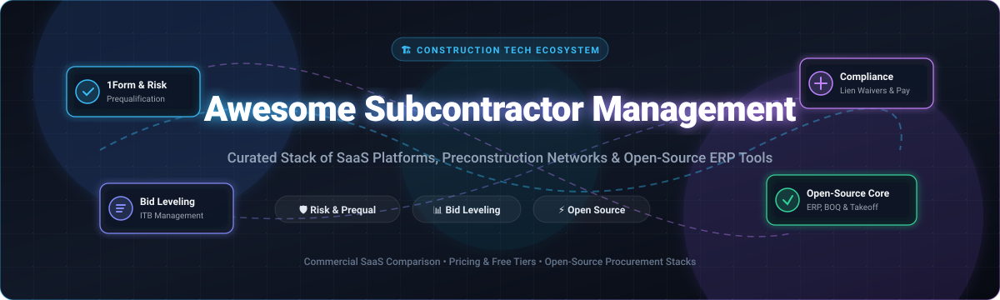

<div align="center">



# 🏗️ Awesome Subcontractor Management

**A curated directory of top-tier SaaS products, commercial preconstruction networks, and open-source tools for Subcontractor Prequalification, Bid Management, Risk Scoring & Construction Procurement.**

<p align="center">
  <a href="https://github.com/ishandutta2007/Awesome-Awesome-Awesome"></a><a href="https://discord.gg/jc4xtF58Ve"></a>
  <a href="https://github.com/ishandutta2007/Awesome-Subcontractor-Management/stargazers"></a>
  <a href="https://github.com/ishandutta2007/Awesome-Subcontractor-Management/network/members"></a>
  <a href="https://github.com/ishandutta2007/Awesome-Subcontractor-Management/blob/main/LICENSE"></a>
  <a href="https://github.com/ishandutta2007/Awesome-Subcontractor-Management/pulse"></a>
  <a href="https://github.com/ishandutta2007"></a>
</p>

---

<p align="center">
  <b>🔍 Keywords:</b> Subcontractor Management Software • Construction Prequalification • Bid Management • Trade Package Leveling • Construction Procurement • Vendor Risk Assessment • Lien Waiver Management • Open-Source Construction ERP • Takeoff &amp; Estimating
</p>

</div>

---

## 📑 Table of Contents

- [🌟 Overview](#-overview)
- [🏢 SaaS/Hosted Platforms](#-saashosted-platforms)
  - [📊 Market Size & Industry Dynamics](#-market-size--industry-dynamics)
  - [💼 Commercial SaaS Comparison Matrix](#-commercial-saas-comparison-matrix)
  - [🚀 Additional Notable Commercial Platforms](#-additional-notable-commercial-platforms)
- [💻 Open-Source GitHub Projects](#-open-source-github-projects)
  - [🏆 Ranked Open-Source Repositories (by Stars)](#-ranked-open-source-repositories-by-stars)
  - [🛠️ Architectural Blueprint for Self-Hosted Stacks](#-architectural-blueprint-for-self-hosted-stacks)
- [🤝 How to Contribute](#-how-to-contribute)
- [📈 Star History](#-star-history)
- [📜 Disclaimer](#-disclaimer)

---

## 🌟 Overview

Subcontractor management represents one of the highest-risk, highest-leverage workflows in the entire Architecture, Engineering, and Construction (AEC) industry. General contractors (GCs), construction managers (CMs), developers, and owners depend on automated solutions to:

- 🛡️ **Prequalification & Risk Scoring:** Streamline 1Form questionnaire submissions, safety metrics (EMR/OSHA), financial stability benchmarking, and insurance/bonding verification.
- 📬 **Bid Invitation & Leveling:** Solicit and track Invitation to Bid (ITB) packages, manage plan rooms, normalize multi-subcontractor line-item proposals, and award contracts.
- 📑 **Compliance & Lien Waivers:** Automate conditional and unconditional progress lien waiver exchanges, certificate of insurance (COI) expirations, and regulatory compliance.
- 💳 **Progress Payments & Billing:** Standardize AIA G702/G703 payment applications, retainage releases, and electronic fund disbursements.

---

## 🏢 SaaS/Hosted Platforms

### 📊 Market Size & Industry Dynamics

> 📈 **Market Size & Industry Dynamics:** The global Subcontractor Management & Construction Bidding Software market is estimated at **$3.8 Billion in 2026** (projected to reach **$6.9 Billion by 2031** at an **11.4% CAGR**). The sector exhibits **moderate-to-high fragmentation** at the regional trade contractor level, while rapidly concentrating at the enterprise GC tier where tech conglomerates (Oracle, Autodesk, Procore, and Roper Technologies) execute "winner-take-most" M&A rollups of specialized prequalification and bidding networks.

---

### 💼 Commercial SaaS Comparison Matrix

*Sorted by Company Size / Market Valuation (Descending)*

| Platform | Company Size (Valuation / Revenue) | Description | Pricing (Starting Tier) | Free Tier / Free Trial Limits |
| :--- | :--- | :--- | :--- | :--- |
| **[Textura (Oracle)](https://www.oracle.com/construction-engineering/textura-payment-management/)** | **~$380B+ Market Cap**<br>*(Oracle Corp, ~$53B+ rev)* | Enterprise subcontractor payment management, automated lien waiver exchange, compliance verification, and AIA progress billing. | Subcontractor fee: **0.22% of contract value** (min $100, max $3,750 per contract); GC platform starts at **$5,000/year** | **30-day enterprise sandbox trial** with sample payment applications, lien waiver exchanges, and compliance approval workflows |
| **[BuildingConnected (Autodesk)](https://www.buildingconnected.com/)** | **~$60B+ Market Cap**<br>*(Autodesk Inc, ~$5.5B+ rev)* | Autodesk's flagship construction bid-management network connecting general contractors and subcontractors with bid leveling and coverage analytics. | Free for basic subcontractor bidding; BuildingConnected Pro for GCs starts at **$249/month** ($2,988/year) | **Free forever** (BuildingConnected Basic: unlimited bid invites received, basic bid board, and bid submissions); **30-day free trial** for Pro |
| **[TradeTapp (Autodesk)](https://www.tradetapp.com/)** | **~$60B+ Market Cap**<br>*(Autodesk Inc, ~$5.5B+ rev)* | Subcontractor qualification and financial/safety risk assessment platform integrated seamlessly with BuildingConnected. | Free for subcontractors; GC qualification management starts at **$3,500/year** (~$291.67/month) | **Free forever** for subcontractors to respond to qualification questionnaires; **30-day free trial** via Autodesk Construction Cloud |
| **[ConstructConnect](https://www.constructconnect.com/)** | **~$60B+ Parent Cap**<br>*(Roper Tech, ~$250M+ div rev)* | Commercial construction project intelligence, lead discovery, digital takeoff, and subcontractor network ecosystem. | Starts at **$125/month** ($1,500/year billed annually) for Project Intelligence & Bid Management Starter | **Free forever** for subcontractors viewing invited project documents; **14-day free trial** with access to regional project leads and plan rooms |
| **[SmartBid (ConstructConnect)](https://smartbid.co/)** | **~$60B+ Parent Cap**<br>*(Roper Tech, ~$250M+ div rev)* | Web-based construction bid management platform for general contractors managing trade databases, ITB distribution, and subcontractor prequalification. | Starts at **$2,500/year** (~$208.33/month billed annually) for up to 3 GC user seats | **Free forever** for subcontractors responding to bid invites; **14-day free trial** for general contractors with full bid solicitation features |
| **[Procore](https://www.procore.com/)** | **~$10B+ Market Cap**<br>*(Procore NYSE: PCOR, ~$1.1B+ rev)* | All-in-one construction management platform covering preconstruction, bid management, subcontractor qualification, financials, and contracts. | Starts at **$375/month** ($4,500/year billed annually) for Preconstruction tier (up to $3M annual construction volume) | **14-day free trial** with access to standard preconstruction sandbox environment, RFP distribution, and subcontractor directory |
| **[COMPASS by Bespoke Metrics](https://compass.bespokemetrics.com/)** | **~$60M–$80M Est. Valuation**<br>*(Private, ~$12M+ rev)* | Subcontractor prequalification, 1Form data collection, independent risk ratings (Q-Score), and performance evaluation suite. | Free for subcontractors; GC enterprise platform starts at **$5,000/year** (~$416.67/month) | **Free forever** for subcontractors (complete 1Form prequalification & share risk profile with unlimited GCs); **14-day GC pilot trial** |
| **[ConWize](https://conwize.io/)** | **~$20M–$30M Est. Valuation**<br>*(Series A VC, ~$3M–$6M rev)* | Cloud-based construction bidding, BOQ, cost estimating, and procurement platform for general contractors and subcontractors. | Free Essential tier; Contractor Marketing starts at **$49/month** ($588/year); Pro Estimating & Bidding starts at **$350/month** ($4,200/year) | **Free forever** (Essential plan: up to 3 users, project management, document uploading, bid invites, and tracking); **14-day free trial** for Pro |
| **[Pantera Global](https://www.getpantera.com/)** | **~$10M–$15M Est. Valuation**<br>*(Private, ~$2M–$4M rev)* | Preconstruction bid management software managing trade packages, invitations to bid (ITB), custom plan rooms, and subcontractor procurement. | Starts at **$150/month** ($1,800/year) for standard bid management; Automation plans start at **$399/month** ($4,788/year + $1,499 setup) | **Free forever** for subcontractors to access plan room and submit bids; **14-day free trial** for general contractors |
| **[SubHub](https://subconconstructionsoftware.com/)** | **~$8M–$12M Est. Valuation**<br>*(Private, ~$1.5M–$3M rev)* | Construction subcontractor management platform focused on organizing subcontractor directories, compliance, and qualification workflows. | Starts at **$49/month** ($588/year billed annually) for standard subcontractor management | **14-day free trial** with full access to qualification questionnaires, vendor directories, and compliance document storage |

---

### 🚀 Additional Notable Commercial Platforms

*Sorted by Company Size / Market Valuation (Descending)*

| Platform | Company Size (Valuation / Revenue) | Description | Pricing (Starting Tier) | Free Tier / Free Trial Limits |
| :--- | :--- | :--- | :--- | :--- |
| **[Autodesk Construction Cloud](https://construction.autodesk.com/)** | **~$60B+ Market Cap**<br>*(Autodesk Inc, ~$5.5B+ rev)* | Unified construction platform connecting preconstruction, bid management, takeoff, and field execution workflows. | Starts at **$45/user/month** ($540/user/year billed annually) for Autodesk Docs; Autodesk Build starts at **$150/user/month** | **30-day free trial** with full access to sheets, document management, project workflows, and up to 50 team members |
| **[Autodesk Forma](https://www.autodesk.com/products/forma/)** | **~$60B+ Market Cap**<br>*(Autodesk Inc, ~$5.5B+ rev)* | AI-powered preconstruction and conceptual design cloud platform with environmental analysis and BuildingConnected integration. | Starts at **$195/user/month** ($1,560/user/year billed annually) | **30-day free trial** with full access to conceptual design, wind/sun/noise analyses, and project collaboration |
| **[Bid Board Pro (Autodesk)](https://www.buildingconnected.com/bid-board-pro/)** | **~$60B+ Market Cap**<br>*(Autodesk Inc, ~$5.5B+ rev)* | Centralized bid-tracking solution for subcontractors to manage incoming bid invites, win/loss analytics, and team assignments. | Starts at **$150/user/month** ($1,800/user/year billed annually) | **Free forever** with BuildingConnected Basic (receive unlimited bid invites, basic bid calendar, manual bid status tracking); **30-day free trial** for Bid Board Pro |
| **[TradeTapp + BuildingConnected](https://www.buildingconnected.com/tradetapp/)** | **~$60B+ Market Cap**<br>*(Autodesk Inc, ~$5.5B+ rev)* | Integrated qualification and bid-selection workflow for evaluating subcontractor financial and safety risk before awarding bids. | Starts at **$350/month** ($4,200/year billed annually) for combined GC qualification and bidding | **Free forever** for subcontractors to complete standard prequalification questionnaires (1Form) and bid submissions |
| **[iSqFt (ConstructConnect)](https://www.isqft.com/)** | **~$60B+ Parent Cap**<br>*(Roper Tech, ~$250M+ div rev)* | Commercial construction bidding network and project lead database for subcontractor discovery and bid distribution. | Free for invited subs; iSqFt Subcontractor / GC network starts at **$110/month** ($1,320/year billed annually) | **Free forever** for subcontractors accessing and submitting bids on GC-invited projects; **14-day free trial** for lead searching and plan downloads |
| **[Procore Bid Management](https://www.procore.com/preconstruction/bid-management)** | **~$10B+ Market Cap**<br>*(Procore NYSE: PCOR, ~$1.1B+ rev)* | Dedicated bid solicitation, RFP distribution, and subcontractor qualification module within Procore Preconstruction. | Starts at **$375/month** ($4,500/year billed annually) bundled in Procore Preconstruction | **14-day free trial/demo sandbox** with access to RFP distribution, subcontractor directory, and bid leveling |
| **[Buildertrend](https://buildertrend.com/)** | **~$1.2B+ Est. Valuation**<br>*(PE backed, ~$150M+ rev)* | Comprehensive construction management platform with estimating, bid management, scheduling, financial tracking, and subcontractor portal. | Starts at **$399/month** ($4,788/year billed annually) for Essential tier | **14-day free trial / money-back guarantee** with unlimited project management, financial tracking, and subcontractor scheduling |
| **[STACK](https://www.stackct.com/)** | **~$150M+ Est. Valuation**<br>*(Private, ~$25M–$30M rev)* | Cloud-based construction takeoff and estimating platform supporting subcontractor bidding, item catalogs, and cost modeling. | Free tier available; Paid STACK Takeoff & Estimating starts at **$249/user/month** ($2,988/user/year billed annually) | **Free forever** (1 user, up to 10 projects, max 10 sheets/plans per project, 7-day plan storage); **7-day full feature trial** |
| **[PlanHub](https://www.planhub.com/)** | **~$50M–$70M Est. Valuation**<br>*(Private Growth, ~$10M–$15M rev)* | Cloud construction bidding marketplace connecting GCs, subcontractors, suppliers, and project opportunities. | Free tier available; Subcontractor Premier starts at **$99/month** ($1,188/year); General Contractor Premier starts at **$199/month** ($2,388/year) | **Free forever** (Subcontractor Basic: access to public postings within 5-mile radius, unlimited bid submissions to invited GCs; GC Basic: free project posting); **14-day Premier trial** |
| **[Contractor Foreman](https://contractorforeman.com/)** | **~$30M–$45M Est. Valuation**<br>*(Private Bootstrap, ~$6M–$10M rev)* | Construction project management suite covering estimating, bids, contracts, scheduling, documents, and subcontractor workflows. | Starts at **$49/month** ($588/year billed annually) for Standard tier (1 user) | **30-day free trial** with unrestricted access to all 35+ modules including bid management, directory, and scheduling (no credit card required) |
| **[Ressio](https://www.ressio.com/)** | **~$6M–$10M Est. Valuation**<br>*(Seed VC, ~$800K–$1.8M rev)* | Modern construction estimating, takeoff, and bidding platform for contractors and subcontractor trade coordination. | Starts at **$150/month** ($1,800/year billed annually) for estimating and bidding | **14-day free trial** with full access to takeoffs, bid leveling, and subcontractor invitation features |
| **[BidBuddy](https://bidbuddy.com/)** | **~$4M–$8M Est. Valuation**<br>*(Seed AI Startup, ~$500K–$1.2M rev)* | AI-assisted construction bidding platform that automates RFP analysis, subcontractor document parsing, and proposal generation. | Starts at **$49/month** ($588/year billed annually) | **14-day free trial** with up to 5 AI document parses and bid summaries |

---

## 💻 Open-Source GitHub Projects

Dedicated open-source subcontractor-management platforms are rarer than commercial SaaS products. However, several world-class open-source ERPs, BIM takeoff tools, AI estimating engines, and digital signature platforms provide the ideal modular building blocks to construct a sovereign, self-hosted subcontractor management and procurement system.

---

### 🏆 Ranked Open-Source Repositories (by Stars)

*Sorted by GitHub Star Counts (Descending)*

| Rank | Open-Source Repository | Github_Stars | Primary Domain / Capabilities |
| :---: | :--- | :---: | :--- |
| **01** | **[Odoo Subcontracting & Construction](https://github.com/odoo/odoo)** | [](https://github.com/odoo/odoo/stargazers) | Comprehensive open-source ERP with native Subcontracting MRP, Purchase Requisitions, Vendor Portals, Project Costing, and Field Service management. |
| **02** | **[ERPNext / Frappe Construction](https://github.com/frappe/erpnext)** | [](https://github.com/frappe/erpnext/stargazers) | Full-scale open-source ERP featuring dedicated Subcontracting Orders, Subcontracted BOMs, Construction Project Management, RFQ comparisons, and Timesheets. |
| **03** | **[Documenso](https://github.com/documenso/documenso)** | [](https://github.com/documenso/documenso/stargazers) | Self-hosted, open-source document signing infrastructure ideal for executing subcontractor master service agreements (MSAs), lien waivers, and COI acknowledgments. |
| **04** | **[OpenProject BIM & Construction](https://github.com/opf/openproject)** | [](https://github.com/opf/openproject/stargazers) | Open-source construction project management platform with 3D IFC/BIM viewer, BCF issue management, Gantt scheduling, and subcontractor trade task tracking. |
| **05** | **[IfcOpenShell (BIM & Takeoff Engine)](https://github.com/IfcOpenShell/IfcOpenShell)** | [](https://github.com/IfcOpenShell/IfcOpenShell/stargazers) | Open-source IFC toolkit and geometry engine for automated quantity takeoff (QTO), element extraction, and trade package scope generation. |
| **06** | **[Apache OFBiz](https://github.com/apache/ofbiz)** | [](https://github.com/apache/ofbiz/stargazers) | Enterprise-grade open-source automation system featuring WorkEffort, Subcontract Work Orders, Vendor RFQs, and multi-tier procurement workflows. |
| **07** | **[BIMserver](https://github.com/opensourceBIM/BIMserver)** | [](https://github.com/opensourceBIM/BIMserver/stargazers) | Open-source Building Information Model server providing centralized IFC revision control, trade package splitting, and multi-subcontractor model coordination. |
| **08** | **[OpenBoxes](https://github.com/openboxes/openboxes)** | [](https://github.com/openboxes/openboxes/stargazers) | Open-source supply chain and inventory management software applicable for tracking subcontractor material deliveries, staging, and jobsite procurement. |
| **09** | **[OpenConstructionERP](https://github.com/datadrivenconstruction/OpenConstructionERP)** | [](https://github.com/datadrivenconstruction/OpenConstructionERP/stargazers) | Construction ERP platform covering Bills of Quantities (BOQ), CAD/BIM takeoff, tendering, subcontractor tracking, and cost estimating. |
| **10** | **[ProjeQtOr](https://github.com/projeqtor/projeqtor)** | [](https://github.com/projeqtor/projeqtor/stargazers) | Quality-centric open-source project management suite supporting milestone delivery, subcontractor risk tracking, bug/incident tickets, and cost accounts. |
| **11** | **[OpenTakeoff](https://github.com/Kentucky-ai/opentakeoff)** | [](https://github.com/Kentucky-ai/opentakeoff/stargazers) | Browser-based open-source PDF takeoff tool with AI-assisted room detection and area/material calculation for subcontractor trade estimators. |
| **12** | **[Bidwright](https://github.com/braedonsaunders/bidwright)** | [](https://github.com/braedonsaunders/bidwright/stargazers) | AI-native construction estimating and bid management platform with scope gap analysis, risk detection, quote normalization, and competitiveness scoring. |
| **13** | **[QuantityTakeoff-Python](https://github.com/datadrivenconstruction/QuantityTakeoff-Python)** | [](https://github.com/datadrivenconstruction/QuantityTakeoff-Python/stargazers) | Python automation toolkit for filtering and extracting trade package element quantities directly from construction data for estimating. |
| **14** | **[BidSheet](https://github.com/krflol/bidsheet)** | [](https://github.com/krflol/bidsheet/stargazers) | Local-first open-source estimating and bidding desktop software designed for underground utility and trade subcontractors (GPLv3). |

---

### 🛠️ Architectural Blueprint for Self-Hosted Stacks

```
┌──────────────────────────────────────────────────────────────────────────┐
│                   SUBCONTRACTOR PORTAL & FRONTEND                        │
│   (Next.js / SvelteKit UI • Subcontractor Onboarding • Bid Submission)  │
└────────────────────────────────────┬─────────────────────────────────────┘
                                     │
┌────────────────────────────────────▼─────────────────────────────────────┐
│                 INTEGRATED OPEN-SOURCE BACKBONE SERVICES                 │
├───────────────────────────────┬──────────────────────────────────────────┤
│ 📦 ERP & Subcontract Work:    │ 🏗️ BIM & Takeoff Engine:                 │
│    • ERPNext / Odoo           │    • IfcOpenShell / BIMserver / OpenTakeoff
├───────────────────────────────┼──────────────────────────────────────────┤
│ ✍️ Compliance & Signatures:   │ 📊 Project Scheduling & BIM Issues:      │
│    • Documenso (Lien Waivers) │    • OpenProject (Gantt & BCF viewer)    │
├───────────────────────────────┼──────────────────────────────────────────┤
│ 🤖 Document AI / Extraction:  │ 🔐 Identity & Access Management:         │
│    • Local LLM + OCR + RAG    │    • Keycloak (RBAC & GC/Sub Permissions)│
└───────────────────────────────┴──────────────────────────────────────────┘
```

> [!TIP]
> **Production Best Practice:** To achieve parity with commercial platforms like TradeTapp or BuildingConnected using open source:
> 1. Use **ERPNext** or **Odoo** as the transactional core (Subcontract Orders, POs, Invoices).
> 2. Pair with **Documenso** for automated lien waiver generation and electronic signatures.
> 3. Add **OpenProject** for 3D BIM coordination and task scheduling.
> 4. Deploy an **OCR + LLM Extraction Pipeline** to ingest Certificates of Insurance (COIs), OSHA 300 logs, and financial statements directly into your database.

---

## 🤝 How to Contribute

We welcome contributions from general contractors, trade subcontractors, estimators, software engineers, and open-source advocates!

1. 🍴 **Fork the repository** on GitHub.
2. 🌿 **Create a feature branch:** `git checkout -b add-new-subcontractor-tool`
3. 📝 **Add your tool to `README.md`:** Follow the established tabular format (include starting pricing, free tier/trial limits, company size/valuation, and star badge for open-source repos).
4. ✅ **Ensure accuracy:** Validate official pricing and project URLs.
5. 🚀 **Submit a Pull Request** with a clear explanation of why the tool belongs in this curated list.

---

## 📈 Star History

[](https://star-history.dera.page/#ishandutta2007/Awesome-Subcontractor-Management&type=date&legend=top-left)

---

## 📜 Disclaimer

This repository is a community-curated directory intended for educational and technological evaluation purposes.
- Subcontractor prequalification, insurance validation, safety evaluations, and financial risk assessments should always be independently audited by licensed professionals prior to awarding material construction contracts.
- Commercial product pricing, licensing tiers, and feature sets are subject to vendor updates; verify current rates directly with software providers.

---

<div align="center">
  <sub>Built with ❤️ for general contractors, trade subcontractors, estimators, procurement managers, and construction technologists worldwide.</sub>
</div>
